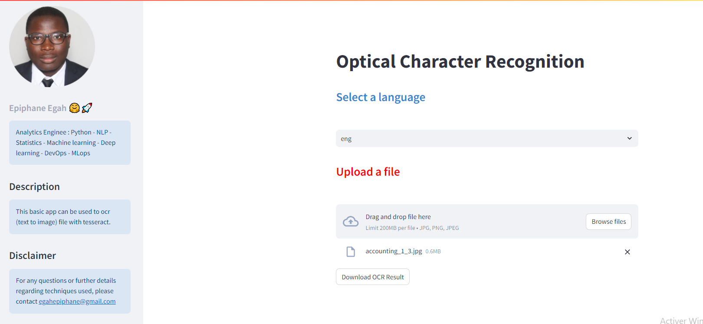

# Optical Character Recognition Engine


<!-- [](https://opensource.org/licenses/MIT) -->

### Overview



This basic app can be used to ocr file with tesseract. Tesseract is an open-source OCR engine that can recognize text in images. It supports over 100 languages and works with a variety of image formats. This application uses Tesseract to extract text from uploaded images, allowing users to digitize printed text easily and quickly.

### Table of Contents
- [Dependencies](#dependencies)
- [Installation](#installation)
- [Usage](#table-of-contents)
- [Features](#installation) <!-- - [Contributing](#contributing) --> <!-- - [License](#license) --> <!-- [Troubleshooting](#troubleshooting) --> <!-- - [FAQ](#faq)--> <!-- - [API Reference](#api-reference) -->
- [Version history](#version-history)
- [Deployment](#deployment) <!-- - [Acknowledgments](#acknowledgements) -->
- [Contact Information](#contact-information)

### Dependencies

This project requires the following frameworks : 

- Python 3.8+
- Streamlit
- Tesseract OCR

### Installation

Follow these steps to get the application running on your local machine:

1. **Clone the repository:**

```bash
git clone https://github.com/egah/ocr-app.git
```
2. **Navigate to the cloned repository:**

```bash
cd ocr-app
```

3. **Install Python dependencies:**

Make sure you have Python 3.8+ installed. Then, install the required libraries using pip:

```bash
python3.8 -m venv venv
source venv/bin/activate
pip install -r requirements.txt
```

4. **Install Tesseract OCR:**
The application uses Tesseract OCR, which needs to be installed separately. Follow the official installation instructions for your operating system. After installation, add the Tesseract executable path to your environment variables.

- on linux os :
```bash
sudo apt update -y
sudo apt upgrade -y
sudo apt install tesseract-ocr
```
5. **Run the application**

```bash
streamlit run app.py
```
The application should now be running at http://localhost:8501.


### Usage
Open your web browser and visit http://localhost:8501. You should see the OCR Engine application running.

Follow the instructions on the web page to use the OCR Engine.
### Features
- language support : this version of the OCR engine only allows you to extract french and english text.
- format of image support : jpeg, jpg and png
### Version history
- 1.1.0 : first version of the OCR engine
<!--### Deployment
Déployement on heroku. You can find below the url of the app. -->
###  Contact information
 [](https://www.linkedin.com/in/egahepiphane/) </a> <a href="mailto:egahepiphane@gmail.com">
      
    </a>